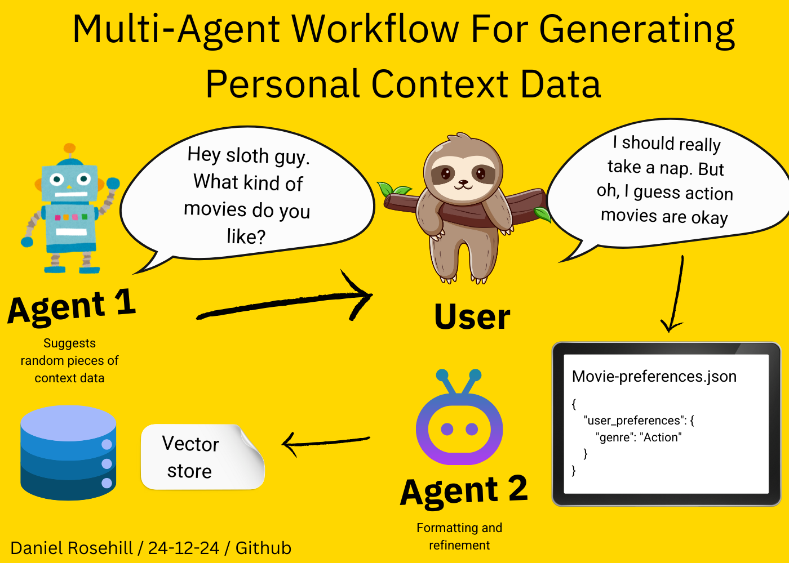

# Contextual Data Generation Bot (Workflow/Assistant Config)

The purpose of this repository is to provide the configuration text for some large language model (LLM) assistants intended to help the user(s) with the specific workflow of generating contextual data for a store in a vector storage repository. 

These assistants reflect a deliberate approach to generating contextual data intended for personal users. 

While some approaches to retaining contextual data in memory take the reverse approach (ie, they continuously update a information store from conversations, which is preferable) this model is suggested as a cruder but simpler way of setting context data through intentionally engaging in that process. 

This can also be a useful method to follow when the intention is to generate a few very targeted pieces of contextual data. For example, the user is generating a assistant to help with a job search and wants to develop only a handful of pieces of context data to guide the assistant's work, such as perhaps mapping out their professional aspirations, previous experience, etc. 

## Intended Workflow

The combination of agents in the configuration folder is intended to provide the skeleton for a workflow whereby the user can sit back and answer questions in order to streamline the generation of these pieces of context data. 

This can be achieved with either a single (combined) agent or with a multi agent workflow. To ensure greater reliability, it is recommended to use the multi agent workflow, providing each agent with a very specific function in the "chain". 

## Multi-Agent Workflow

In the separate workflow, the first assistant is tasked with suggesting topics for pieces of contextual data. 

The first agent configuration uses an obscurity measuring scale with examples as a device where the user is asked to state from 1 to 5 what level of obscurity the topic suggestions should be. 

The intention here is to facilitate the use case where the user is moving towards a more complete store of contextual data. Over the course of time, they may fill up the amount of level 1 and two data they have and therefore have the assistant focus on generating more niche data points to add depth and nuance to the context data store.  

A separate configuration is provided for an agent which is asked to suggest random topics for context data development, but about a specific topic. The intended use case here is the one outlined above in the README, in which the user is developing a relatively thin or limited pool of contextual data intended to provide foundational information for an assistant serving a very specific purpose. 

The second agent is tasked with taking the manner in which the user might communicate this contextual data (free-form, potentially captured using speech to text software) and then converting it into a more rigid format suitable for its intended use. 

All of these agent configurations can be tweaked per the user's requirement. For example, many users might prefer that the second agents be explicitly instructed to generate their contextual information in JSON rather than in natural language or markdown. 

## Combined Agent Workflow

The more ambitious combined agent workflow tries to get one agent to do it all. Firstly, It suggests random pieces of contextual information that should be gathered. Then it lets the user provide that information. Then it reformats it. 

## Saving Context Data To Storage

The final part of the workflow was entail saving the generated contextual data to an organized vector store. 

This could be achieved programmatically. But in this first simple implementation, the agents are simply instructed to output the contextual data within a code fence so that the user can copy it into a file manually and add it to a database. 

For the more modest example intended here of manually uploading these pieces of contextual data to the Open AI Assistants platform this process is reasonably efficient. 

## Author

Daniel Rosehill  
(public at danielrosehill dot com)

## Licensing

All my GitHub repositories are licensed under [Creative Commons Attribution 4.0 International](https://creativecommons.org/licenses/by/4.0/).

### Summary of the License
The Creative Commons Attribution 4.0 Inter national (CC BY 4.0) license allows others to:
- **Share**: Copy and redistribute the material in any medium or format.
- **Adapt**: Remix, transform, and build upon the material for any purpose, even commercially.

The licensor cannot revoke these freedoms as long as you follow the license terms.

#### License Terms
- **Attribution**: You must give appropriate credit, provide a link to the license, and indicate if changes were made. You may do so in any reasonable manner, but not in any way that suggests the licensor endorses you or your use.
- **No additional restrictions**: You may not apply legal terms or technological measures that legally restrict others from doing anything the license permits.

For the full legal code, please visit the [Creative Commons website](https://creativecommons.org/licenses/by/4.0/legalcode).
